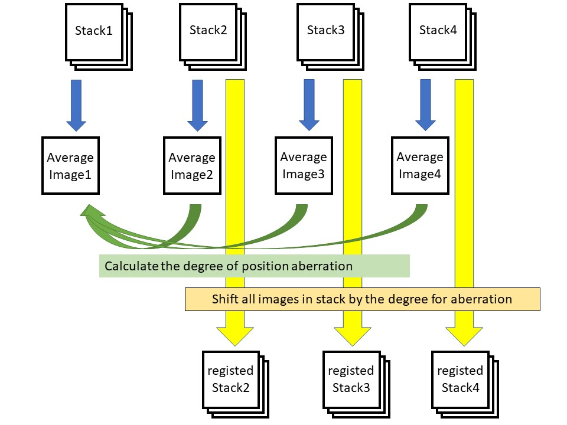
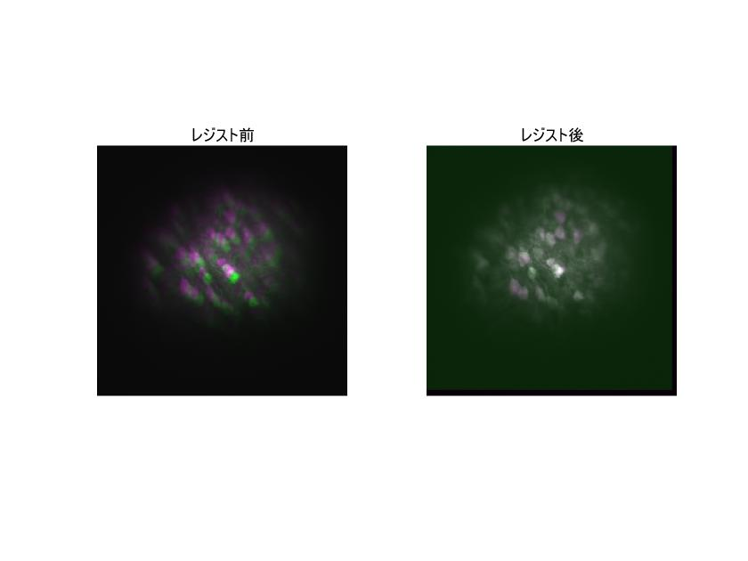

# Stack_registration
registration of multi stack movies to one movie

## Result Figure

## Dependencies
MATLAB

Image Processing Toolbox

(optional) Parallel Computing Toolbox (for GPU use only)

## Author
Takehiro Ajioka 

E-mail:1790651m@stu.kobe-u.ac.jp

## Affiliation

Division of System Neuroscience, Kobe University of Graduate School of Medicine

神戸大学医学研究科システム生理学分野
